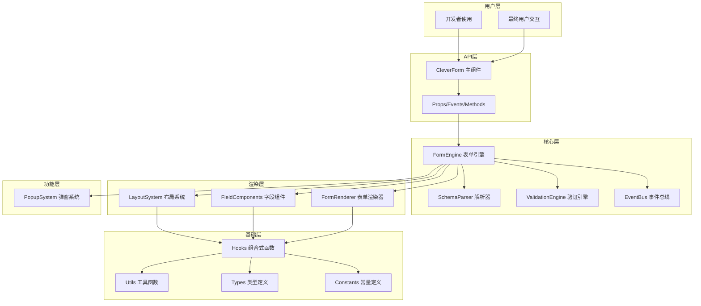
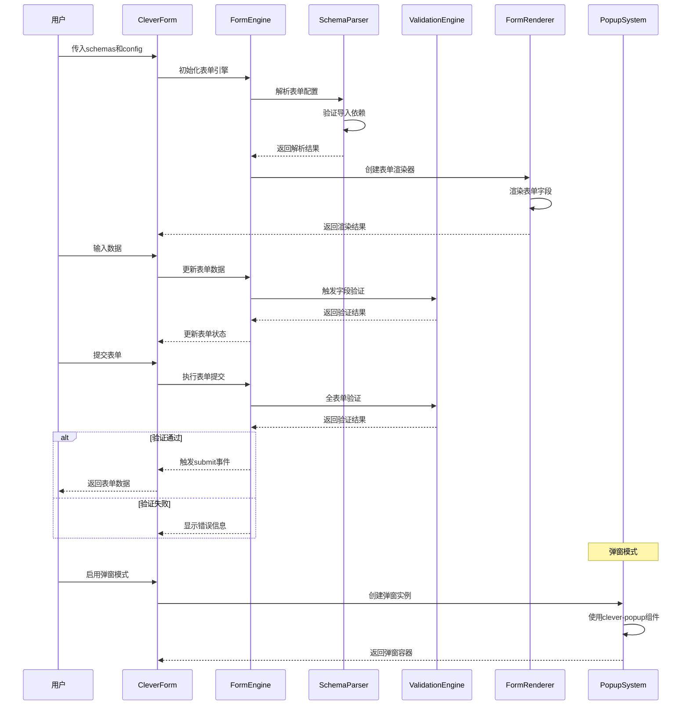

# CleverForm 详细设计文档

> 基于 Vue 3 + TypeScript + Naive UI 的智能表单组件详细技术设计

## 📋 目录

- [技术架构设计](#技术架构设计)
- [核心模块设计](#核心模块设计)
- [API接口设计](#api接口设计)
- [数据流设计](#数据流设计)
- [性能优化设计](#性能优化设计)
- [扩展性设计](#扩展性设计)
- [安全性设计](#安全性设计)
- [测试策略设计](#测试策略设计)

## 🏗️ 技术架构设计

### 整体架构图



### 分层架构说明

#### 1. 用户层 (User Layer)
- **开发者使用**: 通过API接口使用组件
- **最终用户交互**: 与渲染的表单进行交互

#### 2. API层 (API Layer)
- **CleverForm主组件**: 对外暴露的主要接口
- **Props/Events/Methods**: 标准的Vue组件接口

#### 3. 核心层 (Core Layer)
- **FormEngine**: 表单引擎，协调各个模块
- **SchemaParser**: Schema解析器，处理配置解析
- **ValidationEngine**: 验证引擎，处理表单验证
- **EventBus**: 事件总线，处理组件间通信

#### 4. 渲染层 (Render Layer)
- **LayoutSystem**: 布局系统，支持多布局嵌套
- **FieldComponents**: 字段组件，处理具体字段渲染
- **FormRenderer**: 表单渲染器，协调渲染逻辑

#### 5. 功能层 (Feature Layer)
- **PopupSystem**: 弹窗系统，基于clever-popup组件

#### 6. 基础层 (Foundation Layer)
- **Hooks**: 组合式函数，封装业务逻辑
- **Utils**: 工具函数，提供通用功能
- **Types**: TypeScript类型定义
- **Constants**: 常量定义

## 🔧 核心模块设计

### 1. FormEngine 表单引擎

```typescript
interface FormEngine {
  // 初始化表单引擎
  initialize(config: FormConfig): void
  
  // 渲染表单
  render(): VNode
  
  // 获取表单数据
  getFormData(): Record<string, any>
  
  // 设置表单数据
  setFormData(data: Record<string, any>): void
  
  // 验证表单
  validate(): Promise<ValidationResult>
  
  // 重置表单
  reset(): void
  
  // 销毁表单引擎
  destroy(): void
}
```

### 2. SchemaParser 解析器

```typescript
interface SchemaParser {
  // 解析表单配置
  parseSchema(schema: FormSchema[]): ParsedSchema
  
  // 验证配置有效性
  validateSchema(schema: FormSchema[]): ValidationResult
  
  // 解析布局配置
  parseLayout(layout: LayoutConfig): ParsedLayout
  
  // 解析字段配置
  parseField(field: FieldSchema): ParsedField
}
```

### 3. ValidationEngine 验证引擎

```typescript
interface ValidationEngine {
  // 添加验证规则
  addRule(field: string, rule: ValidationRule): void
  
  // 移除验证规则
  removeRule(field: string, ruleId: string): void
  
  // 验证单个字段
  validateField(field: string, value: any): Promise<ValidationResult>
  
  // 验证整个表单
  validateForm(data: Record<string, any>): Promise<ValidationResult>
  
  // 清除验证结果
  clearValidation(field?: string): void
}
```

### 4. LayoutSystem 布局系统

```typescript
interface LayoutSystem {
  // 支持的布局类型
  layoutTypes: {
    grid: GridLayout
    flex: FlexLayout
    inline: InlineLayout
    vertical: VerticalLayout
    tabs: TabsLayout
    accordion: AccordionLayout
    hybrid: HybridLayout // 混合布局，支持多布局嵌套
  }
  
  // 渲染布局
  renderLayout(config: LayoutConfig, children: VNode[]): VNode
  
  // 解析嵌套布局
  parseNestedLayout(config: NestedLayoutConfig): ParsedLayout
  
  // 验证布局配置
  validateLayoutConfig(config: LayoutConfig): boolean
}
```

### 5. PopupSystem 弹窗系统

```typescript
import type { CleverPopupProps } from '@/components/clever-popup/types'

interface PopupSystem {
  // 显示弹窗表单
  showPopup(config: PopupFormConfig): Promise<any>
  
  // 隐藏弹窗
  hidePopup(id: string): void
  
  // 获取弹窗实例
  getPopupInstance(id: string): CleverPopupInstance
  
  // 弹窗配置
  createPopupConfig(formConfig: FormConfig, popupProps: CleverPopupProps): PopupFormConfig
}

interface PopupFormConfig {
  id: string
  title: string
  width?: number | string
  mode?: 'modal' | 'drawer'
  placement?: 'top' | 'right' | 'bottom' | 'left'
  formConfig: FormConfig
  onSubmit?: (data: any) => void
  onCancel?: () => void
}
```


## 📡 API接口设计

### 主组件Props

```typescript
interface CleverFormProps {
  // 表单数据 (v-model)
  modelValue: Record<string, any>
  
  // 表单配置
  schemas: FormSchema[]
  
  // 表单配置选项
  config?: FormConfig
  
  // 布局配置
  layout?: LayoutConfig
  
  // 是否禁用表单
  disabled?: boolean
  
  // 是否只读
  readonly?: boolean
  
  // 弹窗模式配置
  popup?: PopupConfig
  
  // 验证配置
  validation?: ValidationConfig
}
```

### 表单配置类型

```typescript
interface FormConfig {
  // 表单标识
  id?: string
  
  // 表单名称
  name?: string
  
  // 表单描述
  description?: string
  
  // 是否显示标签
  showLabel?: boolean
  
  // 标签位置
  labelPosition?: 'left' | 'top' | 'right'
  
  // 标签宽度
  labelWidth?: number | string
  
  // 字段间距
  fieldSpacing?: number
  
  // 提交按钮配置
  submitButton?: ButtonConfig
  
  // 重置按钮配置
  resetButton?: ButtonConfig
  
  // 自定义按钮
  customButtons?: ButtonConfig[]
}
```

### 字段配置类型

```typescript
interface FormSchema {
  // 字段标识
  field: string
  
  // 字段标签
  label?: string
  
  // 组件类型
  component: FieldComponentType
  
  // 组件属性
  props?: Record<string, any>
  
  // 验证规则
  rules?: ValidationRule[]
  
  // 默认值
  defaultValue?: any
  
  // 是否必填
  required?: boolean
  
  // 是否禁用
  disabled?: boolean
  
  // 是否只读
  readonly?: boolean
  
  // 是否显示
  visible?: boolean | ((formData: Record<string, any>) => boolean)
  
  // 字段依赖
  dependencies?: string[]
  
  // 联动配置
  linkage?: LinkageConfig
  
  // 布局配置
  layout?: FieldLayoutConfig
  
  // 帮助文本
  help?: string
  
  // 占位符
  placeholder?: string
}
```

### 布局配置类型

```typescript
interface LayoutConfig {
  // 布局类型
  type: 'grid' | 'flex' | 'inline' | 'vertical' | 'tabs' | 'accordion' | 'hybrid'
  
  // 布局属性
  props?: Record<string, any>
  
  // 子布局配置（用于嵌套布局）
  children?: LayoutConfig[]
  
  // 字段分组
  groups?: LayoutGroup[]
}

interface LayoutGroup {
  // 分组标识
  id: string
  
  // 分组标题
  title?: string
  
  // 分组字段
  fields: string[]
  
  // 分组布局
  layout?: LayoutConfig
  
  // 是否可折叠
  collapsible?: boolean
  
  // 默认展开状态
  defaultExpanded?: boolean
}

// 混合布局配置
interface HybridLayoutConfig extends LayoutConfig {
  type: 'hybrid'
  // 嵌套布局配置
  layouts: {
    id: string
    layout: LayoutConfig
    fields: string[]
    condition?: (formData: Record<string, any>) => boolean
  }[]
}
```

### 弹窗配置类型

```typescript
interface PopupConfig {
  // 是否启用弹窗模式
  enabled: boolean
  
  // 弹窗标题
  title?: string
  
  // 弹窗宽度
  width?: number | string
  
  // 弹窗模式
  mode?: 'modal' | 'drawer'
  
  // 抽屉位置
  placement?: 'top' | 'right' | 'bottom' | 'left'
  
  // 是否可关闭
  closable?: boolean
  
  // 点击遮罩是否关闭
  maskClosable?: boolean
  
  // 自定义类名
  className?: string
  
  // 自定义样式
  style?: Record<string, any>
}
```

### 验证配置类型

```typescript
interface ValidationConfig {
  // 验证时机
  trigger?: 'change' | 'blur' | 'submit'
  
  // 是否显示验证消息
  showMessage?: boolean
  
  // 验证消息位置
  messagePosition?: 'right' | 'bottom'
  
  // 是否停止首次验证失败
  stopOnFirstError?: boolean
  
  // 自定义验证器
  customValidators?: Record<string, ValidationFunction>
}

interface ValidationRule {
  // 规则类型
  type?: 'required' | 'email' | 'url' | 'number' | 'integer' | 'float' | 'custom'
  
  // 是否必填
  required?: boolean
  
  // 最小长度
  min?: number
  
  // 最大长度
  max?: number
  
  // 正则表达式
  pattern?: RegExp
  
  // 自定义验证函数
  validator?: ValidationFunction
  
  // 错误消息
  message?: string
  
  // 验证时机
  trigger?: 'change' | 'blur'
}

type ValidationFunction = (value: any, formData: Record<string, any>) => boolean | string | Promise<boolean | string>
```

## 🔄 数据流设计

### 数据流向图



### 状态管理

```typescript
interface FormState {
  // 表单数据
  formData: Record<string, any>
  
  // 字段状态
  fieldStates: Record<string, FieldState>
  
  // 验证状态
  validationState: ValidationState
  
  // 表单状态
  formStatus: 'idle' | 'validating' | 'submitting' | 'error' | 'success'
  
  // 弹窗状态
  popupState: PopupState
  
  // 布局状态
  layoutState: LayoutState
}

interface FieldState {
  // 字段值
  value: any
  
  // 是否已修改
  dirty: boolean
  
  // 是否已访问
  touched: boolean
  
  // 是否禁用
  disabled: boolean
  
  // 是否只读
  readonly: boolean
  
  // 是否显示
  visible: boolean
  
  // 验证状态
  validation: FieldValidationState
}

interface ValidationState {
  // 是否正在验证
  validating: boolean
  
  // 验证错误
  errors: Record<string, string[]>
  
  // 验证警告
  warnings: Record<string, string[]>
  
  // 是否有效
  valid: boolean
}
```

## ⚡ 性能优化设计

### 1. 渲染优化

```typescript
// 虚拟化渲染
interface VirtualizationConfig {
  // 是否启用虚拟化
  enabled: boolean
  
  // 可见区域高度
  height: number
  
  // 每项高度
  itemHeight: number
  
  // 缓冲区大小
  bufferSize: number
}

// 懒加载组件
const LazyFieldComponent = defineAsyncComponent({
  loader: () => import('./FieldComponent.vue'),
  loadingComponent: FieldSkeleton,
  errorComponent: FieldError,
  delay: 200,
  timeout: 3000
})
```

### 2. 数据优化

```typescript
// 数据缓存策略
interface CacheConfig {
  // 是否启用缓存
  enabled: boolean
  
  // 缓存策略
  strategy: 'memory' | 'localStorage' | 'sessionStorage'
  
  // 缓存时间
  ttl: number
  
  // 缓存键前缀
  keyPrefix: string
}

// 防抖验证
const debouncedValidation = debounce(async (field: string, value: any) => {
  return await validateField(field, value)
}, 300)
```

### 3. 内存优化

```typescript
// 组件销毁时清理资源
const cleanup = () => {
  // 清理事件监听器
  eventBus.off('field-change', handleFieldChange)
  
  // 清理定时器
  clearTimeout(validationTimer)
  
  // 清理缓存
  cache.clear()
  
  // 清理DOM引用
  formRef.value = null
}

onUnmounted(cleanup)
```

## 🔧 扩展性设计

### 1. 插件系统

```typescript
interface FormPlugin {
  // 插件名称
  name: string
  
  // 插件版本
  version: string
  
  // 安装插件
  install(app: App, options?: any): void
  
  // 卸载插件
  uninstall?(): void
}

// 插件注册
const usePlugin = (plugin: FormPlugin, options?: any) => {
  plugin.install(app, options)
  registeredPlugins.set(plugin.name, plugin)
}
```

### 2. 自定义字段组件

```typescript
// 注册自定义字段组件
const registerFieldComponent = (name: string, component: Component) => {
  // 验证组件是否存在
  if (!component) {
    throw new Error(`Component ${name} is not defined`)
  }
  
  // 验证组件接口
  validateComponentInterface(component)
  
  // 注册组件
  fieldComponents.set(name, component)
}

// 组件接口验证
const validateComponentInterface = (component: Component) => {
  const requiredProps = ['modelValue', 'disabled', 'readonly']
  const requiredEmits = ['update:modelValue', 'change', 'blur']
  
  // 验证必需的props和emits
  // ...
}
```

### 3. 自定义布局

```typescript
// 注册自定义布局
const registerLayout = (name: string, layout: LayoutComponent) => {
  // 验证布局组件
  validateLayoutComponent(layout)
  
  // 注册布局
  layoutComponents.set(name, layout)
}

interface LayoutComponent {
  // 渲染函数
  render(fields: VNode[], config: LayoutConfig): VNode
  
  // 验证配置
  validateConfig?(config: LayoutConfig): boolean
  
  // 默认配置
  defaultConfig?: Partial<LayoutConfig>
}
```

## 🔒 安全性设计

### 1. 输入验证

```typescript
// XSS防护
const sanitizeInput = (value: string): string => {
  return DOMPurify.sanitize(value)
}

// SQL注入防护
const validateSqlInput = (value: string): boolean => {
  const sqlPattern = /('|(\-\-)|(;)|(\||\|)|(\*|\*))/i
  return !sqlPattern.test(value)
}
```

### 2. 类型安全

```typescript
// 严格的类型检查
const validateFieldValue = <T>(value: unknown, schema: FieldSchema): value is T => {
  switch (schema.component) {
    case 'input':
      return typeof value === 'string'
    case 'number-input':
      return typeof value === 'number'
    case 'select':
      return typeof value === 'string' || Array.isArray(value)
    default:
      return true
  }
}
```

### 3. 权限控制

```typescript
// 字段访问控制
interface FieldPermission {
  // 是否可读
  readable: boolean
  
  // 是否可写
  writable: boolean
  
  // 是否可见
  visible: boolean
}

const checkFieldPermission = (field: string, permission: FieldPermission): boolean => {
  // 实现权限检查逻辑
  return permission.readable && permission.writable && permission.visible
}
```

## 🧪 测试策略设计

### 1. 单元测试

```typescript
// 组件测试
describe('CleverForm', () => {
  it('should render form with given schema', () => {
    const wrapper = mount(CleverForm, {
      props: {
        modelValue: {},
        schemas: mockSchemas
      }
    })
    
    expect(wrapper.find('.clever-form').exists()).toBe(true)
  })
  
  it('should validate form data correctly', async () => {
    const wrapper = mount(CleverForm, {
      props: {
        modelValue: { name: '' },
        schemas: [{
          field: 'name',
          component: 'input',
          rules: [{ required: true, message: 'Name is required' }]
        }]
      }
    })
    
    const result = await wrapper.vm.validate()
    expect(result.valid).toBe(false)
    expect(result.errors.name).toContain('Name is required')
  })
})
```

### 2. 集成测试

```typescript
// 表单提交流程测试
describe('Form Submission Flow', () => {
  it('should complete full submission process', async () => {
    const onSubmit = vi.fn()
    const wrapper = mount(CleverForm, {
      props: {
        modelValue: { name: 'John', email: 'john@example.com' },
        schemas: mockSchemas,
        onSubmit
      }
    })
    
    await wrapper.find('form').trigger('submit')
    expect(onSubmit).toHaveBeenCalledWith({
      name: 'John',
      email: 'john@example.com'
    })
  })
})
```

### 3. E2E测试

```typescript
// 端到端测试
describe('CleverForm E2E', () => {
  it('should handle complex form interactions', async () => {
    await page.goto('/form-demo')
    
    // 填写表单
    await page.fill('[data-testid="name-input"]', 'John Doe')
    await page.fill('[data-testid="email-input"]', 'john@example.com')
    
    // 提交表单
    await page.click('[data-testid="submit-button"]')
    
    // 验证结果
    await expect(page.locator('[data-testid="success-message"]')).toBeVisible()
  })
})
```

## 📚 总结

本设计文档详细描述了CleverForm组件的技术架构和实现方案，主要特点包括：

1. **模块化架构**: 清晰的分层设计，便于维护和扩展
2. **类型安全**: 完整的TypeScript类型定义，确保类型安全
3. **多布局嵌套**: 支持复杂的布局组合和嵌套
4. **弹窗集成**: 基于clever-popup组件的弹窗系统
5. **导入验证**: 确保所有依赖的存在性和合理性
6. **性能优化**: 虚拟化渲染和懒加载等优化策略
7. **扩展性**: 插件系统和自定义组件支持
8. **安全性**: 输入验证和XSS防护
9. **测试覆盖**: 完整的测试策略

通过这个设计，CleverForm将成为一个功能强大、类型安全、性能优异的现代化表单解决方案。