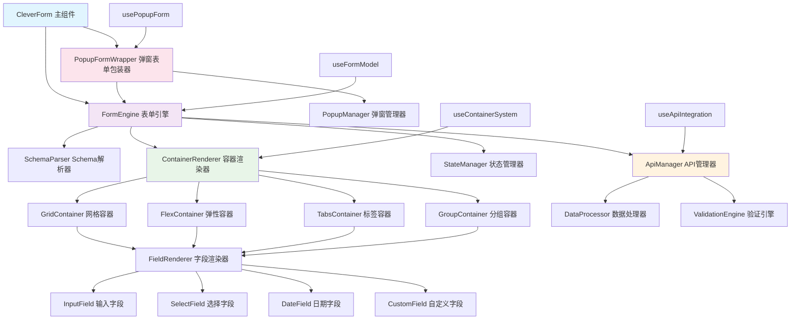

# CleverForm 文件结构设计

> 基于容器化架构和 JSON Schema 驱动的详细文件结构设计和组件关系说明

## 🎯 设计原则

- **容器化架构**: 支持多种布局容器的嵌套组合
- **JSON Schema 驱动**: 完全基于 Schema 配置的表单生成
- **API 集成**: 内置数据源和验证的 API 集成能力
- **Naive UI 验证**: 深度集成 Naive UI 的验证系统
- **弹窗集成**: 原生支持弹窗表单的完整解决方案
- **高性能渲染**: 支持 500+ 字段的高效渲染

## 📁 总体文件结构

```
clever-form/
├── src/                           # 源代码目录
│   ├── types/                     # 类型定义
│   │   ├── index.ts              # 类型导出入口
│   │   ├── form.ts               # 表单相关类型
│   │   ├── field.ts              # 字段相关类型
│   │   ├── layout.ts             # 布局相关类型
│   │   ├── validation.ts         # 验证相关类型
│   │   ├── popup.ts              # 弹窗相关类型
│   │   ├── events.ts             # 事件相关类型
│   │   └── import.ts             # 导入验证相关类型
│   ├── constants/                 # 常量定义
│   │   ├── index.ts              # 常量导出入口
│   │   ├── field-types.ts        # 字段类型常量
│   │   ├── layout-types.ts       # 布局类型常量
│   │   ├── validation-rules.ts   # 验证规则常量
│   │   ├── event-types.ts        # 事件类型常量
│   │   └── default-config.ts     # 默认配置常量
│   ├── utils/                     # 工具函数
│   │   ├── index.ts              # 工具函数导出入口
│   │   ├── schema.ts             # Schema 辅助函数
│   │   ├── form.ts               # 表单工具函数
│   │   ├── data.ts               # 数据处理工具
│   │   ├── validation.ts         # 验证工具
│   │   ├── format.ts             # 格式化工具

│   ├── hooks/                     # 组合式函数
│   │   ├── index.ts              # hooks 导出入口
│   │   ├── useFormModel.ts       # 表单数据管理
│   │   ├── useFormValidation.ts  # 表单验证管理
│   │   ├── useFormLayout.ts      # 表单布局管理
│   │   ├── useFieldComponent.ts  # 字段组件管理
│   │   ├── useFieldValidation.ts # 字段验证管理
│   │   ├── useFieldEvents.ts     # 字段事件管理
│   │   ├── usePopupForm.ts       # 弹窗表单管理

│   ├── components/                # 组件目录
   │   ├── form-engine/          # 表单引擎
   │   │   ├── index.ts          # 表单引擎导出
   │   │   ├── FormEngine.vue    # 表单引擎主组件
   │   │   ├── SchemaParser.ts   # Schema解析器
   │   │   ├── ContainerEngine.ts # 容器引擎
   │   │   ├── FieldRenderer.vue # 字段渲染器
   │   │   ├── ValidationEngine.ts # 验证引擎
   │   │   └── StateManager.ts   # 状态管理器
   │   ├── container-system/     # 容器化布局系统
   │   │   ├── index.ts          # 容器系统导出
   │   │   ├── GridContainer.vue # 网格容器
   │   │   ├── FlexContainer.vue # 弹性容器
   │   │   ├── TabsContainer.vue # 标签页容器
   │   │   ├── GroupContainer.vue # 分组容器
   │   │   ├── ContainerRenderer.vue # 容器渲染器
   │   │   └── ContainerWrapper.vue # 容器包装器
   │   ├── api-integration/      # API 集成系统
   │   │   ├── index.ts          # API 集成导出
   │   │   ├── ApiManager.ts     # API 管理器
   │   │   ├── DataProcessor.ts  # 数据处理器
   │   │   ├── DataSource.vue    # 数据源组件
   │   │   └── AsyncValidator.ts # 异步验证器
│   │   ├── field-components/     # 字段组件
│   │   │   ├── index.ts          # 字段组件导出
│   │   │   ├── base/             # 基础组件
│   │   │   │   ├── BaseField.vue # 字段基础组件
│   │   │   │   └── FieldWrapper.vue # 字段包装器
│   │   │   ├── input/            # 输入类组件
│   │   │   │   ├── InputField.vue # 文本输入框
│   │   │   │   ├── NumberInputField.vue # 数字输入框
│   │   │   │   ├── TextareaField.vue # 文本域
│   │   │   │   ├── PasswordField.vue # 密码输入框
│   │   │   │   └── SearchField.vue # 搜索框
│   │   │   ├── select/           # 选择类组件
│   │   │   │   ├── SelectField.vue # 下拉选择
│   │   │   │   ├── RadioGroupField.vue # 单选框组
│   │   │   │   ├── CheckboxGroupField.vue # 复选框组
│   │   │   │   ├── CascaderField.vue # 级联选择
│   │   │   │   └── TransferField.vue # 穿梭框
│   │   │   ├── datetime/         # 日期时间类组件
│   │   │   │   ├── DatePickerField.vue # 日期选择器
│   │   │   │   ├── TimePickerField.vue # 时间选择器
│   │   │   │   ├── DateTimePickerField.vue # 日期时间选择器
│   │   │   │   └── DateRangePickerField.vue # 日期范围选择器
│   │   │   └── other/            # 其他组件
│   │   │       ├── SwitchField.vue # 开关
│   │   │       ├── SliderField.vue # 滑块
│   │   │       ├── RateField.vue # 评分
│   │   │       ├── ColorPickerField.vue # 颜色选择器
│   │   │       └── UploadField.vue # 文件上传
│   │   ├── form-renderer/        # 表单渲染器
│   │   │   ├── index.ts          # 渲染器导出
│   │   │   ├── FormRenderer.vue  # 表单渲染器组件
│   │   │   ├── FieldRenderer.vue # 字段渲染器组件
│   │   │   ├── GroupRenderer.vue # 字段组渲染器
│   │   │   ├── ContainerRenderer.vue # 字段容器渲染器
│   │   │   └── ContentRenderer.vue # 容器内容渲染器
   │   ├── popup-system/         # 弹窗集成系统
   │   │   ├── index.ts          # 弹窗系统导出
   │   │   ├── PopupFormWrapper.vue # 弹窗表单包装器
   │   │   ├── PopupContainer.vue # 弹窗容器组件
   │   │   ├── PopupManager.ts   # 弹窗管理器
   │   │   └── PopupEvents.ts    # 弹窗事件处理
   │   └── utils-components/     # 工具辅助组件
   │       ├── index.ts          # 工具组件导出
   │       ├── SchemaValidator.ts # Schema 验证器
   │       ├── StateManager.ts   # 状态管理器
   │       └── PerformanceMonitor.ts # 性能监控器
├── index.vue                      # 主组件入口
├── types.ts                       # 类型定义入口
├── constants.ts                   # 常量定义入口
├── utils.ts                       # 工具函数入口
├── hooks.ts                       # 组合式函数入口
├── README.md                      # 组件说明文档
├── DETAILED_DESIGN.md            # 详细设计文档
├── FILE_STRUCTURE_DESIGN.md      # 文件结构设计文档
└── REQUIREMENTS_ANALYSIS.md      # 需求分析文档
```

## 📂 核心目录详解

### 1. types/ 类型定义目录

#### 文件职责说明

```typescript
// types/index.ts - 类型导出入口
export * from './form'
export * from './field'
export * from './layout'
export * from './validation'
export * from './popup'
export * from './events'
export * from './import'

// types/form.ts - 表单相关类型
export interface FormSchema {
  containers: ContainerConfig[]
  config?: FormConfig
  api?: ApiConfig
  validation?: ValidationConfig
}

export interface FormConfig {
  id?: string
  name?: string
  description?: string
  showLabel?: boolean
  labelPosition?: 'left' | 'top' | 'right'
  labelWidth?: number | string
  submitButton?: ButtonConfig
  resetButton?: ButtonConfig
}

export interface FieldSchema {
  field: string
  label?: string
  component: FieldComponentType
  props?: Record<string, any>
  rules?: ValidationRule[]
  defaultValue?: any
  required?: boolean
  disabled?: boolean
  readonly?: boolean
  visible?: boolean | ((formData: Record<string, any>) => boolean)
  api?: FieldApiConfig
}

// types/container.ts - 容器相关类型
export interface ContainerConfig {
  type: 'grid' | 'flex' | 'tabs' | 'group'
  title?: string
  props?: Record<string, any>
  children: (ContainerConfig | FieldSchema)[]
  condition?: (formData: Record<string, any>) => boolean
}

export interface GridContainerProps {
  cols?: number
  xGap?: number
  yGap?: number
  responsive?: ResponsiveConfig
}

export interface TabsContainerProps {
  type?: 'line' | 'card' | 'segment'
  placement?: 'top' | 'right' | 'bottom' | 'left'
  animated?: boolean
}

// types/api.ts - API 集成类型
export interface ApiConfig {
  baseURL?: string
  timeout?: number
  headers?: Record<string, string>
  interceptors?: ApiInterceptors
}

export interface FieldApiConfig {
  dataSource?: string | ApiEndpoint
  validation?: string | ApiEndpoint
  transform?: (data: any) => any
}

// types/popup.ts - 弹窗相关类型
export interface PopupConfig {
  enabled: boolean
  title?: string
  width?: number | string
  mode?: 'modal' | 'drawer'
  placement?: 'top' | 'right' | 'bottom' | 'left'
  closable?: boolean
  maskClosable?: boolean
  className?: string
  style?: Record<string, any>
}

// types/import.ts - 导入验证相关类型
export interface ImportConfig {
  name: string
  type: 'component' | 'util' | 'type'
  path: string
  required: boolean
}

export interface ImportValidationResult {
  valid: boolean
  missing: string[]
  errors: string[]
}
```

### 2. constants/ 常量定义目录

#### 文件职责说明

```typescript
// constants/field-types.ts - 字段类型常量
export const FIELD_TYPES = {
  INPUT: 'input',
  NUMBER_INPUT: 'number-input',
  TEXTAREA: 'textarea',
  PASSWORD: 'password',
  SEARCH: 'search',
  SELECT: 'select',
  RADIO_GROUP: 'radio-group',
  CHECKBOX_GROUP: 'checkbox-group',
  CASCADER: 'cascader',
  TRANSFER: 'transfer',
  DATE_PICKER: 'date-picker',
  TIME_PICKER: 'time-picker',
  DATETIME_PICKER: 'datetime-picker',
  DATE_RANGE_PICKER: 'date-range-picker',
  SWITCH: 'switch',
  SLIDER: 'slider',
  RATE: 'rate',
  COLOR_PICKER: 'color-picker',
  UPLOAD: 'upload'
} as const

// constants/container-types.ts - 容器类型常量
export const CONTAINER_TYPES = {
  GRID: 'grid',
  FLEX: 'flex',
  TABS: 'tabs',
  GROUP: 'group'
} as const

// constants/api-config.ts - API 配置常量
export const DEFAULT_API_CONFIG: ApiConfig = {
  timeout: 10000,
  headers: {
    'Content-Type': 'application/json'
  }
}

export const API_METHODS = {
  GET: 'GET',
  POST: 'POST',
  PUT: 'PUT',
  DELETE: 'DELETE'
} as const

// constants/default-config.ts - 默认配置常量
export const DEFAULT_FORM_CONFIG: FormConfig = {
  showLabel: true,
  labelPosition: 'left',
  labelWidth: 120
}

export const DEFAULT_POPUP_CONFIG: PopupConfig = {
  enabled: false,
  mode: 'modal',
  width: 520,
  placement: 'right',
  closable: true,
  maskClosable: true
}
```

### 3. utils/ 工具函数目录

#### 文件职责说明

```typescript
// utils/schema.ts - Schema 辅助函数
export const parseFormSchema = (schema: FormSchema): ParsedFormSchema => {
  return {
    containers: parseContainers(schema.containers),
    config: { ...DEFAULT_FORM_CONFIG, ...schema.config },
    api: { ...DEFAULT_API_CONFIG, ...schema.api },
    validation: parseValidationConfig(schema.validation)
  }
}

export const parseContainers = (containers: ContainerConfig[]): ParsedContainer[] => {
  return containers.map(container => ({
    ...container,
    id: generateContainerId(container.type),
    children: parseContainerChildren(container.children)
  }))
}

export const validateSchemaStructure = (schema: FormSchema): boolean => {
  return !!(schema.containers && Array.isArray(schema.containers))
}

// utils/api.ts - API 工具函数
export const createApiManager = (config: ApiConfig): ApiManager => {
  return new ApiManager(config)
}

export const processApiResponse = (response: any, transform?: Function): any => {
  return transform ? transform(response) : response
}


```

### 4. hooks/ 组合式函数目录

#### 文件职责说明

```typescript
// hooks/useFormModel.ts - 表单数据管理
export const useFormModel = (initialData: Record<string, any> = {}) => {
  const formData = ref(initialData)
  
  const setFieldValue = (field: string, value: any) => {
    formData.value[field] = value
  }
  
  const getFieldValue = (field: string) => {
    return formData.value[field]
  }
  
  const resetForm = () => {
    formData.value = { ...initialData }
  }
  
  return {
    formData,
    setFieldValue,
    getFieldValue,
    resetForm
  }
}

// hooks/useContainerSystem.ts - 容器系统管理
export const useContainerSystem = (containers: ContainerConfig[]) => {
  const parsedContainers = ref(parseContainers(containers))
  
  const renderContainer = (container: ContainerConfig) => {
    return {
      component: getContainerComponent(container.type),
      props: container.props,
      children: container.children
    }
  }
  
  const validateContainerConfig = (config: ContainerConfig): boolean => {
    return CONTAINER_TYPES[config.type.toUpperCase() as keyof typeof CONTAINER_TYPES] !== undefined
  }
  
  const findFieldInContainers = (fieldName: string): FieldSchema | null => {
    // 递归查找字段
    return findFieldRecursive(parsedContainers.value, fieldName)
  }
  
  return {
    parsedContainers,
    renderContainer,
    validateContainerConfig,
    findFieldInContainers
  }
}

// hooks/useApiIntegration.ts - API 集成管理
export const useApiIntegration = (apiConfig?: ApiConfig) => {
  const apiManager = ref(apiConfig ? createApiManager(apiConfig) : null)
  
  const fetchFieldData = async (endpoint: string | ApiEndpoint) => {
    if (!apiManager.value) return []
    return await apiManager.value.get(endpoint)
  }
  
  const validateFieldAsync = async (field: string, value: any, endpoint: string | ApiEndpoint) => {
    if (!apiManager.value) return true
    return await apiManager.value.post(endpoint, { field, value })
  }
  
  return {
    apiManager,
    fetchFieldData,
    validateFieldAsync
  }
}

// hooks/usePopupForm.ts - 弹窗表单管理
export const usePopupForm = (popupConfig: PopupConfig) => {
  const visible = ref(false)
  const popupInstance = ref<any>(null)
  
  const showPopup = () => {
    visible.value = true
  }
  
  const hidePopup = () => {
    visible.value = false
  }
  
  const createPopupProps = () => {
    return {
      visible: visible.value,
      title: popupConfig.title,
      width: popupConfig.width,
      mode: popupConfig.mode,
      placement: popupConfig.placement
    }
  }
  
  return {
    visible,
    popupInstance,
    showPopup,
    hidePopup,
    createPopupProps
  }
}


```

### 5. components/ 组件目录

#### 5.1 form-engine/ 表单引擎

```typescript
// components/form-engine/FormEngine.vue
<template>
  <div class="clever-form-engine">
    <ContainerRenderer
      :containers="parsedContainers"
      :form-data="formData"
      :api-manager="apiManager"
      @field-change="handleFieldChange"
      @submit="handleSubmit"
    />
  </div>
</template>

<script setup lang="ts">
import { computed, ref, watch } from 'vue'
import type { FormSchema } from '../../types'
import { SchemaParser } from './SchemaParser'
import { ContainerEngine } from './ContainerEngine'
import { ValidationEngine } from './ValidationEngine'
import { StateManager } from './StateManager'
import ContainerRenderer from '../container-system/ContainerRenderer.vue'
import { useApiIntegration } from '../../hooks'

interface Props {
  schema: FormSchema
  modelValue?: Record<string, any>
}

const props = withDefaults(defineProps<Props>(), {
  modelValue: () => ({})
})

const emit = defineEmits<{
  'update:modelValue': [value: Record<string, any>]
  'submit': [data: Record<string, any>]
  'field-change': [field: string, value: any]
}>()

// 解析 Schema
const parsedSchema = computed(() => SchemaParser.parse(props.schema))
const parsedContainers = computed(() => parsedSchema.value.containers)

// 表单数据管理
const formData = ref(props.modelValue)
watch(() => props.modelValue, (newVal) => {
  formData.value = newVal
}, { deep: true })

// API 集成
const { apiManager } = useApiIntegration(parsedSchema.value.api)

// 事件处理
const handleFieldChange = (field: string, value: any) => {
  formData.value[field] = value
  emit('update:modelValue', formData.value)
  emit('field-change', field, value)
}

const handleSubmit = (data: Record<string, any>) => {
  emit('submit', data)
}
</script>
```

#### 5.2 container-system/ 容器系统

```typescript
// components/container-system/ContainerRenderer.vue
<template>
  <div class="clever-container-renderer">
    <template v-for="container in containers" :key="container.id">
      <component
        :is="getContainerComponent(container.type)"
        :config="container"
        :form-data="formData"
        :api-manager="apiManager"
        @field-change="handleFieldChange"
        @submit="handleSubmit"
      />
    </template>
  </div>
</template>

<script setup lang="ts">
import { computed } from 'vue'
import type { ContainerConfig } from '../../types'
import GridContainer from './GridContainer.vue'
import FlexContainer from './FlexContainer.vue'
import TabsContainer from './TabsContainer.vue'
import GroupContainer from './GroupContainer.vue'

interface Props {
  containers: ContainerConfig[]
  formData: Record<string, any>
  apiManager?: any
}

const props = defineProps<Props>()
const emit = defineEmits<{
  'field-change': [field: string, value: any]
  'submit': [data: Record<string, any>]
}>()

// 获取容器组件
const getContainerComponent = (type: string) => {
  const componentMap = {
    grid: GridContainer,
    flex: FlexContainer,
    tabs: TabsContainer,
    group: GroupContainer
  }
  return componentMap[type as keyof typeof componentMap] || GroupContainer
}

// 事件处理
const handleFieldChange = (field: string, value: any) => {
  emit('field-change', field, value)
}

const handleSubmit = (data: Record<string, any>) => {
  emit('submit', data)
}

</script>
```

// components/container-system/GridContainer.vue
<template>
  <div class="clever-grid-container" :style="gridStyle">
    <template v-for="item in config.children" :key="item.id">
      <FieldRenderer
        v-if="item.type === 'field'"
        :field="item"
        :form-data="formData"
        :api-manager="apiManager"
        @field-change="handleFieldChange"
      />
      <ContainerRenderer
        v-else
        :containers="[item]"
        :form-data="formData"
        :api-manager="apiManager"
        @field-change="handleFieldChange"
        @submit="handleSubmit"
      />
    </template>
  </div>
</template>

<script setup lang="ts">
import { computed } from 'vue'
import type { ContainerConfig } from '../../types'
import FieldRenderer from '../field-components/FieldRenderer.vue'
import ContainerRenderer from './ContainerRenderer.vue'

interface Props {
  config: ContainerConfig
  formData: Record<string, any>
  apiManager?: any
}

const props = defineProps<Props>()
const emit = defineEmits<{
  'field-change': [field: string, value: any]
  'submit': [data: Record<string, any>]
}>()

// 网格样式
const gridStyle = computed(() => {
  const { columns, gap, responsive } = props.config.props as any
  return {
    display: 'grid',
    gridTemplateColumns: `repeat(${columns}, 1fr)`,
    gap: gap || '16px',
    ...(responsive && {
      '@media (max-width: 768px)': {
        gridTemplateColumns: '1fr'
      }
    })
  }
})

const handleFieldChange = (field: string, value: any) => {
  emit('field-change', field, value)
}

const handleSubmit = (data: Record<string, any>) => {
  emit('submit', data)
}
</script>
```

#### 5.3 api-integration/ API 集成系统

```typescript
// components/api-integration/ApiManager.ts
export class ApiManager {
  private baseURL: string
  private headers: Record<string, string>
  
  constructor(config: ApiConfig) {
    this.baseURL = config.baseURL
    this.headers = config.headers || {}
  }
  
  async get(endpoint: string | ApiEndpoint): Promise<any> {
    const url = typeof endpoint === 'string' ? endpoint : endpoint.url
    const response = await fetch(`${this.baseURL}${url}`, {
      method: 'GET',
      headers: this.headers
    })
    return response.json()
  }
  
  async post(endpoint: string | ApiEndpoint, data: any): Promise<any> {
    const url = typeof endpoint === 'string' ? endpoint : endpoint.url
    const response = await fetch(`${this.baseURL}${url}`, {
      method: 'POST',
      headers: {
        'Content-Type': 'application/json',
        ...this.headers
      },
      body: JSON.stringify(data)
    })
    return response.json()
  }
}
```

#### 5.4 popup-system/ 弹窗系统

```typescript
// components/popup-system/PopupContainer.vue
<template>
  <CleverPopup
    v-model:visible="visible"
    :title="config.title"
    :width="config.width"
    :mode="config.mode"
    :placement="config.placement"
    :closable="config.closable"
    :mask-closable="config.maskClosable"
    :class="config.className"
    :style="config.style"
    @close="handleClose"
  >
    <slot />
    
    <template #footer>
      <slot name="footer">
        <div class="popup-form-actions">
          <NButton @click="handleCancel">取消</NButton>
          <NButton type="primary" @click="handleConfirm">确定</NButton>
        </div>
      </slot>
    </template>
  </CleverPopup>
</template>

<script setup lang="ts">
import { ref } from 'vue'
import { NButton } from 'naive-ui'
import CleverPopup from '@/components/clever-popup/index.vue'
import type { PopupConfig } from '../../types'

interface Props {
  config: PopupConfig
  modelValue?: boolean
}

const props = defineProps<Props>()
const emit = defineEmits<{
  'update:modelValue': [value: boolean]
  'confirm': []
  'cancel': []
  'close': []
}>()

const visible = computed({
  get: () => props.modelValue ?? false,
  set: (value) => emit('update:modelValue', value)
})

const handleConfirm = () => {
  emit('confirm')
}

const handleCancel = () => {
  visible.value = false
  emit('cancel')
}

const handleClose = () => {
  emit('close')
}
</script>
```

## 🔗 组件关系图



## 📋 核心设计原则

### 1. 容器化架构
- **统一容器接口**: 所有布局容器实现统一的 `ContainerConfig` 接口
- **递归渲染**: 支持容器嵌套，实现复杂布局结构
- **组件解耦**: 容器与字段组件完全分离，提高可维护性

### 2. JSON Schema 驱动
- **声明式配置**: 通过 JSON Schema 完全描述表单结构
- **类型安全**: 完整的 TypeScript 类型定义
- **动态解析**: 运行时动态解析和渲染表单

### 3. API 集成设计
- **统一 API 管理**: 通过 `ApiManager` 统一处理所有 API 调用
- **字段级 API**: 支持字段级别的数据获取和验证
- **异步处理**: 完整的异步数据处理流程

### 4. 高性能渲染
- **按需渲染**: 只渲染可见的组件和字段
- **状态优化**: 精确的状态管理，减少不必要的重渲染
- **缓存机制**: 智能缓存解析结果和API响应

### 5. 弹窗集成
- **无缝集成**: 与 `clever-popup` 组件完美集成
- **多种模式**: 支持 drawer、modal、popover 等多种弹窗模式
- **状态同步**: 弹窗内外表单状态完全同步

## 🚀 实现优势

1. **架构清晰**: 分层设计，职责明确
2. **扩展性强**: 容器化架构支持无限扩展
3. **类型安全**: 完整的 TypeScript 支持
4. **性能优异**: 智能渲染和缓存机制
5. **易于维护**: 模块化设计，便于维护和测试
```

## 📋 文件依赖关系

### 类型依赖

```typescript
// 类型依赖层次
types/index.ts
├── types/form.ts
├── types/field.ts
├── types/layout.ts
├── types/validation.ts
├── types/popup.ts
├── types/events.ts
└── types/import.ts

// 组件依赖类型
components/form-engine/FormEngine.vue
├── types/form.ts
├── types/field.ts
├── types/layout.ts
└── types/validation.ts

components/popup-system/PopupContainer.vue
├── types/popup.ts
└── @/components/clever-popup/types.ts
```

### 工具函数依赖

```typescript
// 工具函数依赖
utils/index.ts
├── utils/schema.ts
├── utils/form.ts
├── utils/validation.ts
└── utils/import-validator.ts

// 组件使用工具函数
components/form-engine/SchemaParser.ts
├── utils/schema.ts
└── utils/validation.ts

components/form-engine/ImportValidator.ts
└── utils/import-validator.ts
```

### 组件依赖

```typescript
// 主组件依赖
index.vue
├── components/form-engine/FormEngine.vue
├── components/popup-system/PopupContainer.vue
├── hooks/useFormModel.ts
├── hooks/useFormValidation.ts
└── hooks/usePopupForm.ts

// 表单引擎依赖
components/form-engine/FormEngine.vue
├── components/form-renderer/FormRenderer.vue
├── components/form-engine/SchemaParser.ts
└── components/form-engine/ValidationEngine.ts

// 弹窗系统依赖
components/popup-system/PopupContainer.vue
└── @/components/clever-popup/index.vue
```

## 🎯 设计原则

### 1. 模块化设计
- **单一职责**: 每个文件和模块只负责一个特定功能
- **低耦合**: 模块间依赖关系清晰，避免循环依赖
- **高内聚**: 相关功能集中在同一模块内

### 2. 类型安全
- **完整类型定义**: 所有接口和类型都有明确定义
- **类型导出**: 统一的类型导出入口
- **类型验证**: 运行时类型检查和验证

### 3. 可扩展性
- **插件化架构**: 支持自定义组件和布局
- **配置驱动**: 通过配置实现功能扩展
- **钩子系统**: 提供丰富的生命周期钩子

### 4. 性能优化
- **懒加载**: 组件按需加载
- **缓存机制**: 解析结果和验证结果缓存
- **虚拟化**: 大型表单虚拟化渲染

### 5. 开发体验
- **清晰结构**: 文件结构清晰易懂
- **完整文档**: 每个模块都有详细说明
- **调试友好**: 提供调试工具和错误提示

## 📝 总结

本文件结构设计基于容器化架构和 JSON Schema 驱动的设计理念，遵循以下核心原则：

1. **容器化架构**: 采用统一的容器接口，支持递归嵌套和灵活布局
2. **JSON Schema 驱动**: 通过声明式配置完全描述表单结构
3. **API 集成**: 统一的 API 管理和字段级数据处理
4. **弹窗集成**: 与 `clever-popup` 组件无缝集成
5. **类型安全**: 完整的 TypeScript 类型定义
6. **高性能**: 智能渲染和缓存机制

通过这个重构后的文件结构设计，`clever-form` 组件将具有更清晰的架构、更强的扩展能力和更好的开发体验。

---

> 本文档基于容器化架构和 JSON Schema 驱动的设计理念，为 `clever-form` 组件提供了完整的文件结构设计方案。